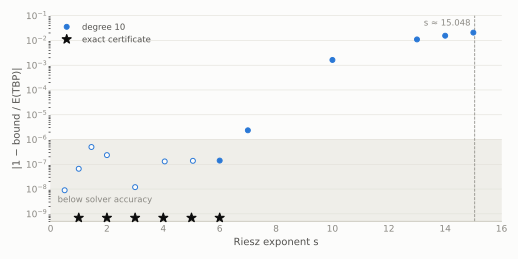

# Five points on the sphere: exact three-point certificates for the Riesz energies $`s = 1, \dots, 6`$, and Lean formalisations for $`s = 1`$ (Coulomb) and $`s = 2`$

[](https://doi.org/10.5281/zenodo.23125753)

Status: **produced by AI models under the direction of the repository owner; not peer reviewed** (see
[`AI_DISCLOSURE.md`](AI_DISCLOSURE.md)).

> [!IMPORTANT]
> This repository is a public, timestamped, AI-produced **warrant** for the uniqueness of the triangular bipyramid as
> the minimiser of the Riesz $`s`$-energy of five points on $`S^2`$ for $`s = 1, \dots, 6`$: a machine-checked
> argument that no human has yet digested. The theorems it certifies are already known (Schwartz; see below); what is
> new here, as far as we know, is the form of the certificates. Independent verification and human-readable
> expositions are welcome, and credit for a human-readable treatment of this argument belongs to whoever writes one.
> To refer to the computational result, please cite the archived repository
> ([10.5281/zenodo.23125753](https://doi.org/10.5281/zenodo.23125753)). Questions, checks and corrections:
> [GitHub issues](https://github.com/alejandrozarco/five-points-riesz/issues).

## Statement

For points $`x_1, \dots, x_5`$ on the unit sphere $`S^2 \subset \mathbb{R}^3`$ and $`s > 0`$, let

```math
E_s(x) = \sum_{i < j} \lVert x_i - x_j \rVert^{-s}.
```

The six certificates in `certificate/` give, for $`s = 1, 2, 3, 4, 5, 6`$ and all pairwise distinct
$`x_1,\dots,x_5 \in S^2`$,

```math
E_s(x) \ \ge\ E_s(\mathrm{TBP}) = 2^{-s} + 6 \cdot 2^{-s/2} + 3 \cdot 3^{-s/2},
```

where TBP is the triangular bipyramid: two antipodal poles and an equilateral triangle on the equator. Equality holds
only for the TBP, up to an orthogonal map of $`\mathbb{R}^3`$ and a relabelling of the points.

| $`s`$ | $`E_s(\mathrm{TBP})`$ | numbers in the certificate | file | check time |
|---|---|---|---|---|
| 1 (Coulomb; the five-electron Thomson problem) | $`\tfrac12 + 3\sqrt2 + \sqrt3`$ | $`K = \mathbb{Q}(\sqrt2, \sqrt3)`$ | `cert_n5_s1.json.gz` (7.5 MB) | about 5 min |
| 2 | $`\tfrac{17}{4}`$ | $`\mathbb{Q}`$ | `cert_n5_s2.json.gz` (3.4 MB) | about 1.5 min |
| 3 | $`\tfrac18 + \tfrac32\sqrt2 + \tfrac13\sqrt3`$ | $`K`$ | `cert_n5_s3.json.gz` (7.4 MB) | about 5 min |
| 4 | $`\tfrac{91}{48}`$ | $`\mathbb{Q}`$ | `cert_n5_s4.json.gz` (3.4 MB) | about 1.5 min |
| 5 | $`\tfrac1{32} + \tfrac34\sqrt2 + \tfrac19\sqrt3`$ | $`K`$ | `cert_n5_s5.json.gz` (7.6 MB) | about 5 min |
| 6 | $`\tfrac{505}{576}`$ | $`\mathbb{Q}`$ | `cert_n5_s6.json.gz` (3.3 MB) | about 1.5 min |

**Known results.** Schwartz established the cases $`s = 1`$ and $`s = 2`$ (*The five-electron case of Thomson's
problem*, Exp. Math. 22 (2013)). His later work establishes uniqueness of the TBP for all $`0 < s < s_*`$,
$`s_* \approx 15.048`$ (*The phase transition in 5 point energy minimization*; *Divide and conquer: a distributed
approach to five point energy minimization*, arXiv:2301.05090). The logarithmic case is Dragnev, Legg and Townsend,
Pacific J. Math. 207 (2002). Both of Schwartz's arguments are computer-assisted, by subdivision of the configuration
space.

**Form of the certificates.** For each energy, the lower bound is a single global three-point
semidefinite-programming certificate of Bachoc–Vallentin and Cohn–Woo type, of polynomial degree 10. There is no
subdivision of the configuration space, and the bound is sharp: it equals $`E_s(\mathrm{TBP})`$ exactly. All six
certificates have the same shape (the same facial reduction and block sizes); only the numbers differ. Verification
uses exact arithmetic. Uniqueness then follows from a finite enumeration of Gram matrices.
- For even $`s`$ all numbers are rational.
- For odd $`s`$ the values of the kernel at the TBP are irrational, so the certificate's numbers lie in
  $`K = \mathbb{Q}(\sqrt2, \sqrt3)`$. They are stored exactly as $`a + b\sqrt2 + c\sqrt3 + d\sqrt6`$ with rational
  $`a, b, c, d`$. The checker for odd $`s`$ additionally uses rational box enclosures of $`\sqrt2, \sqrt3, \sqrt6`$ and
  Bernstein subdivision of $`[-1, 1]`$ (both exact).

Related computations:
- Cohn and Woo (*Three-point bounds for energy minimization*, J. Amer. Math. Soc. 25 (2012), §5.3) report that,
  apart from the two cases identified by Bachoc and Vallentin, they found no sharp three-point energy bounds on
  spheres.
- De Laat (*Moment methods in energy minimization: new bounds for Riesz minimal energy problems*, Trans. Amer. Math.
  Soc. 373 (2020), 1407–1453; arXiv:1610.04905) computed four-point bounds for five points (two truncations of his
  hierarchy) whose values agree with the TBP energy to 28 digits for $`s = 1, \dots, 7`$.

We are not aware of an earlier published exact three-point certificate for these five-point results. Pointers to
earlier work are welcome.

## Range of the method (floating point)

<picture>
  <source media="(prefers-color-scheme: dark)" srcset="figures/sharpness_dark.svg">
  
</picture>

The same three-point bound at degree 10, solved in floating point (no facial reduction, no touching conditions) for a
range of $`s`$. To keep the solver stable, the sampled constraint is $`H \le \min(\varphi_s, 20 e_s + 10)`$, which is
stronger than $`H \le \varphi_s`$; for larger $`s`$ the solver's $`H`$ reaches this cap. The values are numerical
estimates of a capped, sampled SDP, not certified lower bounds. The vertical axis is
$`|1 - \text{bound}/E_s(\mathrm{TBP})|`$. Filled markers: the solver's value lies below $`E_s(\mathrm{TBP})`$. Hollow
markers: it lies slightly above, which can only be numerical error. The shaded band (below $`10^{-6}`$) is roughly the
solver's accuracy for small $`s`$. Stars: the exact certificates of this repository.

- Up to $`s = 6`$ the discrepancy is within the solver's accuracy.
- At $`s = 7`$ it is $`2.4\cdot10^{-6}`$, at $`s = 10`$ $`1.6\cdot10^{-3}`$ ($`1.5\cdot10^{-3}`$ with a five times larger cap,
  in a less accurate solver run), and at $`s = 13`$ to $`15`$ one to two percent.
- Several values of $`s`$ failed in the solver; they are recorded in the data.

So the tested capped degree-10 SDPs show growing numerical discrepancies from the TBP energy between about $`s = 7`$ and
$`s = 10`$. These runs establish neither a sharpness threshold nor a limitation of the unrestricted three-point method
(higher degrees could not be tested: with this solver the degree-12 and degree-14 problems mostly failed). They are
floating-point observations, not certified statements. Data, scripts and the failed runs: [`scan/`](scan/) (see
`scan/run_scan.sh`); the figure is regenerated by `python3 figures/make_figures.py`.

## Why a certificate implies the bound

Write $`t_{ij} = \langle x_i, x_j\rangle`$ and $`\varphi_s(t) = (2-2t)^{-s/2}`$, so $`E_s = \sum_{i<j} \varphi_s(t_{ij})`$. Let
$`e_s = E_s(\mathrm{TBP})`$. Each certificate consists of:
- a univariate polynomial $`H`$ of degree 10;
- positive semidefinite matrices $`F_k`$ ($`k = 0,\dots,3`$);
- positive semidefinite Gram matrices $`B_r`$.

All entries are exact: rationals for even $`s`$, elements of $`K`$ for odd $`s`$. Define

- $`Q_0 = 1`$, $`Q_1 = t - uv`$, $`Q_{k+1} = 2(t-uv)Q_k - (1-u^2)(1-v^2)Q_{k-1}`$;
- $`S(u,v,t) = \sum_k \sum_{a,b} (F_k)_{ab}\,\mathrm{Sym}\big(u^a v^b Q_k(u,v,t)\big)`$, where Sym averages over the
  six permutations of $`(u,v,t)`$;
- $`R = 3S(u,v,t) + S(u,u,1) + S(v,v,1) + S(t,t,1) + \tfrac14 S(1,1,1)`$.

The checker verifies four things:

1. **Identity** in $`\mathbb{Q}[u,v,t]`$, respectively $`K[u,v,t]`$ (checked as four rational identities, one per
   $`K`$-component):
   $`\tfrac13\big(H(u)+H(v)+H(t)\big) - \tfrac{e_s}{10} - R = \sum_r g_r\, z_r^{\mathsf T} B_r z_r`$, where
   - $`g_r \in \{1,\ 1\pm u,\ 1\pm v,\ 1\pm t,\ \det G\}`$;
   - $`\det G = 1 + 2uvt - u^2 - v^2 - t^2`$;
   - $`z_r`$ are vectors of monomials.
2. **Positive definiteness.** The matrices are stored in reduced form, $`F_k = N_k F_k' N_k^{\mathsf T}`$ and
   $`B_r = M_r B_r' M_r^{\mathsf T}`$, and every $`F_k'`$ and $`B_r'`$ is symmetric and positive definite (exact
   leading principal minors). For odd $`s`$ each reduced matrix is affine in $`(\sqrt2, \sqrt3, \sqrt6)`$. It is
   checked to be positive definite at the 8 corners of a rational box of width $`10^{-60}`$ containing that point,
   which by convexity of the positive definite cone covers the true point.
3. **$`H \le \varphi_s`$ on $`[-1,1)`$, with equality exactly at $`t \in \{-1, -\tfrac12, 0\}`$.**
   - Even $`s`$: $`1 - (2-2t)^{s/2}H(t) = (t+1)(2t+1)^2 t^2\, q(t)`$ with $`q > 0`$ on $`[-1,1]`$ (exact root
     counting).
   - Odd $`s`$: $`H > 0`$ on $`[-1,1]`$, and $`1 - (2-2t)^s H(t)^2 = (t+1)(2t+1)^2 t^2\, q(t)`$ with $`q > 0`$ on
     $`[-1,1]`$. Both are shown by exact Bernstein coefficients (with exact subdivision), using an exact sign test
     for elements of $`K`$.
4. **Uniqueness enumeration.** It lists the 5×5 Gram matrices with off-diagonal entries in $`\{-1,-\tfrac12,0\}`$
   that are positive semidefinite (all principal minors $`\ge 0`$) of rank $`\le 3`$. There are 25: the TBP in 10
   labellings, and $`\{\pm e_1, \pm e_2, e_3\}`$ in 15. Energy $`e_s`$ occurs only for the 10 labellings
   of the TBP (exact comparisons, in $`K`$ for odd $`s`$).

The argument from these checks has five steps:
- **The right-hand side is nonnegative.** For a triple of unit vectors with Gram entries $`(u,v,t)`$, every
  $`g_r \ge 0`$: $`|u|,|v|,|t| \le 1`$, and $`\det G \ge 0`$ because $`\det G`$ is a 3×3 Gram determinant. So the
  right-hand side of (1) is $`\ge 0`$ at $`(t_{ij}, t_{il}, t_{jl})`$ for every triple $`\{i,j,l\}`$.
- **Positivity of $`S`$** (Bachoc–Vallentin). Fix a centre $`x_i`$. Let $`w_j \in \mathbb{C}`$ be the projection of
  $`x_j`$ to the tangent plane at $`x_i`$, in a complex coordinate. Then
  $`Q_k(t_{ij}, t_{il}, t_{jl}) = \mathrm{Re}(w_j^k \overline{w_l^k})`$, so
  $`\sum_{j,l} \sum_{a,b} (F_k)_{ab}\, t_{ij}^a t_{il}^b Q_k = \mathrm{Re}(c^* F_k c) \ge 0`$, with
  $`c_a = \sum_j t_{ij}^a w_j^k`$. Summing over centres gives $`\sum_{i,j,l \in [5]} S(t_{ij}, t_{il}, t_{jl}) \ge 0`$;
  the symmetrisation does not change the full sum.
- **Summing over triples.** Split the full sum over $`(i,j,l)`$ by coincidences of indices. This gives
  $`\sum_{\{i,j,l\}} R = \tfrac{n-2}{6}\sum_{i,j,l} S = \tfrac12 \sum_{i,j,l} S \ge 0`$ for $`n = 5`$.
- **The bound on $`\sum H`$.** Summing (1) over the 10 triples gives
  $`\sum_{i<j} H(t_{ij}) - e_s = \sum_{\{i,j,l\}} \big(\text{RHS of (1)}\big) + \tfrac12 \sum_{i,j,l} S \ge 0`$.
- **Conclusion.** By (3), $`E_s = \sum \varphi_s(t_{ij}) \ge \sum H(t_{ij}) \ge e_s`$. Equality forces
  $`t_{ij} \in \{-1, -\tfrac12, 0\}`$ for all pairs. By (4) the configuration is then the TBP; its Gram matrix fixes
  it up to an orthogonal map.

## Verify

```sh
pip install sympy python-flint          # tested with Python 3.9, sympy 1.14.0, python-flint 0.6.0
gunzip -k certificate/cert_n5_s*.json.gz
shasum -a 256 -c certificate/cert_n5_s*.json.sha256
python3 check/check_n5_even.py certificate/cert_n5_s2.json 2      # even s: about 1.5 minutes each
python3 check/check_n5_even.py certificate/cert_n5_s4.json 4
python3 check/check_n5_even.py certificate/cert_n5_s6.json 6
python3 check/check_n5_odd.py certificate/cert_n5_s1.json 1       # odd s: about 5 minutes each
python3 check/check_n5_odd.py certificate/cert_n5_s3.json 3
python3 check/check_n5_odd.py certificate/cert_n5_s5.json 5
```

The exponent $`s`$ is a command-line argument, not read from the certificate: the checker computes $`E_s(\mathrm{TBP})`$
and $`\varphi_s`$ itself and rejects a certificate whose $`e`$ differs. Each checker reads only its JSON and recomputes
(1)–(4) exactly: rational arithmetic, exact sign decisions in $`K`$, and an exact principal-minor test for positive
semidefiniteness in the enumeration. It prints `CERTIFICATE VERIFIED`, and it refuses to run with `python -O`, which
would disable its assertions. The outputs of the recorded runs are in `verification/`.

## Lean formalisation ($`s = 1`$ and $`s = 2`$, `lean/`)

For the Coulomb energy ($`s = 1`$, the five-electron Thomson problem) and for $`s = 2`$ the whole statement is also
checked in Lean 4 (v4.34.1, Mathlib `d13f23b`). [`lean/N5R1/Challenge.lean`](lean/N5R1/Challenge.lean) and
[`lean/N5R2/Challenge.lean`](lean/N5R2/Challenge.lean) state, with the definitions of the Coulomb formalisation of seven
points (`ThomsonN7.R3`, `ThomsonN7.SphereConfig`: five pairwise distinct unit vectors of $`\mathbb{R}^3`$, and, for
$`s = 1`$, its energy `ThomsonN7.coulombEnergy x = ∑_{i<j} 1 / ‖x i - x j‖`),

```lean
theorem five_coulomb :
    ∀ x ∈ SphereConfig 5, coulombEnergy triBipyramid ≤ coulombEnergy x
theorem five_coulomb_unique :
    ∀ x ∈ SphereConfig 5, coulombEnergy x = coulombEnergy triBipyramid →
      ∃ (g : R3 ≃ₗᵢ[ℝ] R3) (σ : Equiv.Perm (Fin 5)), ∀ i, x i = g (triBipyramid (σ i))
theorem five_riesz2 :
    ∀ x ∈ SphereConfig 5, riesz2Energy triBipyramid ≤ riesz2Energy x
theorem five_riesz2_unique :
    ∀ x ∈ SphereConfig 5, riesz2Energy x = riesz2Energy triBipyramid →
      ∃ (g : R3 ≃ₗᵢ[ℝ] R3) (σ : Equiv.Perm (Fin 5)), ∀ i, x i = g (triBipyramid (σ i))
```

with `riesz2Energy x = ∑_{i<j} (‖x i - x j‖ ^ 2)⁻¹` and `triBipyramid` the poles $`\pm e_3`$ and an equilateral triangle on
the equator. The Lean development has the same structure as the Python check:
- the certificate, checked by `decide +kernel`: `certificate/cert_n5_s2_short.json` and `certificate/cert_n5_s1_short.json`,
  re-roundings of the $`s = 2`$ and $`s = 1`$ certificates with short exact numbers (at most 102 and 99 bits; the
  independent checkers also verify them), translated to Lean by `lean/gen/emit_n5.py` and `lean/gen/emit_n5_s1.py`
  (`N5R2.Data`, `N5R2.Chk*`, `N5R2.Check`; `N5R1.Data`, `N5R1.Blocks`, `N5R1.Chk*`, `N5R1.Check`);
- the three-point bound for all unit vectors, $`\sum_{i<j} H(\langle x_i, x_j\rangle) \ge e_s`$ (`N5R2.Bound`, `N5R1.Bound`),
  from the three-point bound of the Coulomb formalisation of seven points (`ThreePoint`, `Cert3`) with facially reduced
  blocks (`ThomsonGen/Cert/NBlk.lean`; `Cert3N.lean` for $`s = 2`$, `Cert3K.lean` for $`s = 1`$). For $`s = 1`$ the certificate's numbers lie in
  $`\mathbb{Q}(\sqrt2, \sqrt3)`$; Lean never computes in that field. The identity is checked as three rational
  identities (components $`1, \sqrt2, \sqrt3`$; the $`\sqrt6`$ components vanish), and positive semidefiniteness at
  $`(\sqrt2, \sqrt3)`$ follows from rational checks at the four corners of a box of width $`2^{-32}`$ around it, because
  each quadratic form is affine in $`(\sqrt2, \sqrt3)`$ (`ThomsonGen/Cert/Cert3K.lean`, `N5R1/Corner.lean`);
- $`H \le \varphi_s`$ on $`[-1, 1)`$, equality exactly at $`-1, -\tfrac12, 0`$ (`N5R2Minor.Minor`, `N5R1Minor.Minor`:
  factorisation and Bernstein coefficients, by `ring`; for $`s = 1`$ with rational bounds on $`\sqrt2, \sqrt3, \sqrt6`$);
- minimality, and uniqueness via the inner-product values and an isometry fixed by three vectors (`N5R2.Main`,
  `N5R1.Main`).

`#print axioms` reports only `propext`, `Classical.choice` and `Quot.sound` for all four theorems. The support modules
taken from the Coulomb formalisation of seven points ([huwngtran/thomson-n7-lean](https://github.com/huwngtran/thomson-n7-lean),
which has no licence) are not stored here: `lean/regen.sh` regenerates them from a pinned commit and checks their
hashes. Build and checks:

```sh
cd lean && ./regen.sh && lake exe cache get && lake build      # about 70 min on one core; up to 9 GB of memory
bash scripts/run_comparator.sh comparator.json                   # leanprover/comparator, s = 2: Challenge vs Solution
bash scripts/run_comparator.sh comparator_s1.json                # the same for s = 1
TARGET=s2 bash scripts/second-kernel.sh                          # nanoda, an independent type checker, + negative control
TARGET=s1 bash scripts/second-kernel.sh
```

On 2026-10-04 Comparator reported "Your solution is okay!" for both configurations, and nanoda checked both exports
("Checked 41928 declarations with no errors" for $`s = 2`$, "Checked 44165 declarations with no errors" for $`s = 1`$; in
each case a copy with one literal changed was rejected by its type checker). Records: `verification/lean/`
(`record_v4_2026-10-04.txt`; the version 3 records for $`s = 2`$ are kept).

## How the certificates were found (`construction/`, not needed for verification)

| file | role |
|---|---|
| `polyk.py` | polynomial and SOS toolkit; numpy, cvxpy, Clarabel |
| `0_identity_and_kernels.py` | numerical check of the triple-sum identity; ranks of the kernel matrices at the TBP (2, 0, 1, 1) |
| `1_build_sdp.py` | even $`s`$: exact facial reduction from sharpness at the TBP; float SDP of degree 10 in the reduced coordinates; exact constraint system → `stage.pkl` |
| `2_project_exact.py` | even $`s`$: exact least-norm projection onto {identity with $`e = e_s`$; $`H = \varphi_s`$ at $`-1, -\tfrac12, 0`$; $`H' = \varphi_s'`$ at $`-\tfrac12, 0`$} → `stage2.pkl` |
| `3_check_and_write.py` | even $`s`$: exact checks, then writes `cert_n5_s<s>.json` |
| `1c_build_sdp_coulomb.py` | odd $`s`$: the same facial reduction; float SDP with every block shifted by $`2\cdot10^{-7} I`$; exact constraint system with right-hand side in $`K`$ → `stage_s<s>.pkl` |
| `2c_exact_coulomb.py`, `kfield.py` | odd $`s`$: exact least-norm projection per $`K`$-component (including the touching conditions), box-corner and Bernstein checks, enumeration, then writes `cert_n5_s<s>.json` |

Run, in a copy of `construction/`:
- even $`s`$: `RIESZ_S=s POLYD=10 python3 1_build_sdp.py 4 && python3 2_project_exact.py && python3 3_check_and_write.py`
  (about 2 minutes);
- odd $`s`$: `RIESZ_S=s POLYD=10 python3 1c_build_sdp_coulomb.py 4 && RIESZ_S=s python3 2c_exact_coulomb.py` (about
  5 minutes).

For $`s > 2`$ the sampled constraint in the float SDP is $`H \le \min(\varphi_s, 20 e_s + 10)`$, which is stronger and
better conditioned; the exact certificate does not depend on it. For odd $`s`$, Clarabel failed numerically when the
irrational touching conditions were also imposed in the float SDP, so they are imposed only in the exact projection.
On the machine used (macOS arm64, Python 3.9.6, numpy 1.26.4, scipy 1.13.1, cvxpy 1.7.5, Clarabel 0.11.1, sympy
1.14.0, python-flint 0.6.0) reruns reproduced all six JSON files byte for byte (transcripts with output hashes:
`verification/construction_s<s>.txt`). The floating-point SDP step may give different exact coefficients with other
solvers or environments, so verify any regenerated JSON with the independent checker.

Numerically, the same uncut degree-10 bound also appears sharp for the logarithmic energy, to solver precision. No
certificate for that case is included: there the kernel's values at the TBP are logarithms.

## Related work and credits

- C. Bachoc, F. Vallentin, *New upper bounds for kissing numbers from semidefinite programming*, J. Amer. Math. Soc.
  21 (2008): three-point bounds on spheres.
- H. Cohn, J. Woo, *Three-point bounds for energy minimization*, J. Amer. Math. Soc. 25 (2012).
- R. E. Schwartz, *The five-electron case of Thomson's problem*, Exp. Math. 22 (2013), arXiv:1001.3702 ($`s = 1, 2`$); *The phase
  transition in 5 point energy minimization* (monograph); *Divide and conquer: a distributed approach to five point
  energy minimization*, arXiv:2301.05090.
- P. D. Dragnev, D. A. Legg, D. W. Townsend, *Discrete logarithmic energy on the sphere*, Pacific J. Math. 207 (2002),
  345–358.
- The formulation of the three-point bound follows section 5 of `paper/PAPER.md` in Hung Tran's Lean formalisation of
  the Coulomb case for seven points ([huwngtran/thomson-n7-lean](https://github.com/huwngtran/thomson-n7-lean)). That
  formalisation follows the eight-point method of L. Kryvonos, L. Liehr and M. A. Taylor (arXiv:2609.22077) and its
  Lean development by J. Tooby-Smith and A. Zughaid
  ([Thomson-N-8-Warrant](https://github.com/jstoobysmith/Thomson-N-8-Warrant)). The Lean development adapts a few
  declarations from huwngtran/thomson-n7-lean, marked "Attribution" or "Adapted from" in the files concerned (`N5R2/` and `N5R1/`
  `Challenge.lean`, `Solution.lean`, `Main.lean`, `Check.lean`; `ThomsonGen/Cert/NBlk.lean`, `Cert3N.lean`,
  `Cert3K.lean`; and the script `lean/scripts/run_comparator.sh`); `lean/ThomsonGen/scripts/scan_upstream.py` lists
  them and checks that each is attributed. The support modules taken
  from it are not stored here but regenerated by `lean/regen.sh`. No other code from those repositories is included.
- D. de Laat, *Moment methods in energy minimization: new bounds for Riesz minimal energy problems*, Trans. Amer.
  Math. Soc. 373 (2020), 1407–1453, doi:10.1090/tran/7976, arXiv:1610.04905: numerically sharp four-point bounds for
  five points.
- The question whether these methods give a simpler five-point argument was raised by Jason Rute on the Lean Zulip
  (Autoformalization > Thomson problem, 2026-09-29).
- Companion repository (seven points, logarithmic energy):
  [alejandrozarco/thomson-n7-log](https://github.com/alejandrozarco/thomson-n7-log).

## Licence

Apache License 2.0 ([`LICENSE`](LICENSE)), for the code, data and text of this repository's authors. The
declarations and script lines marked as adapted from huwngtran/thomson-n7-lean (see "Related work and credits") are
derived from a repository that states no licence; they are included with attribution, and no licence to that
upstream material is granted here.
